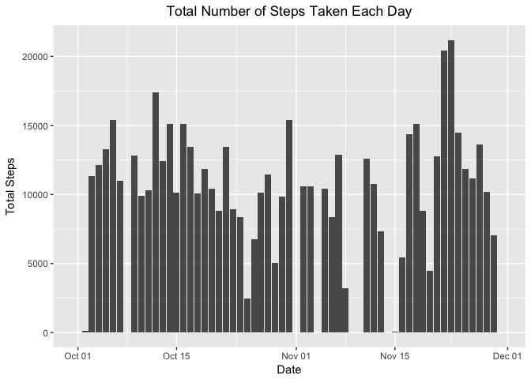
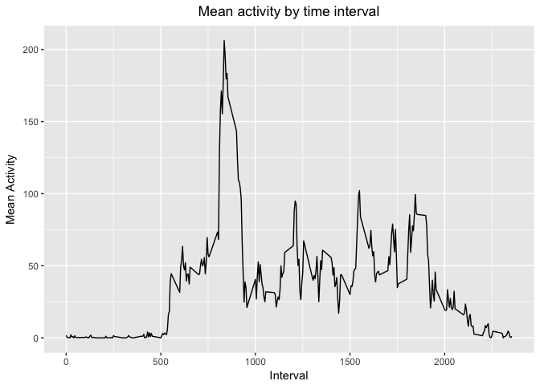
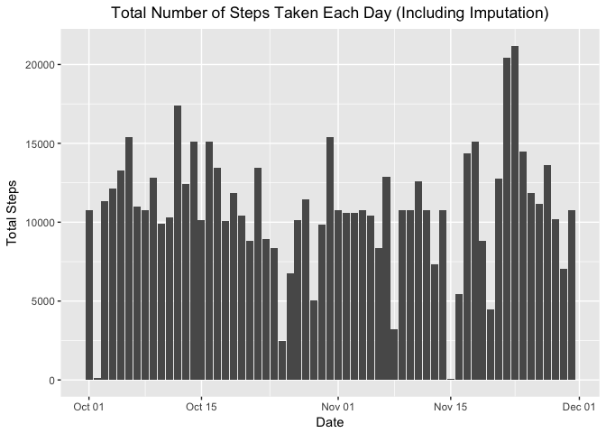
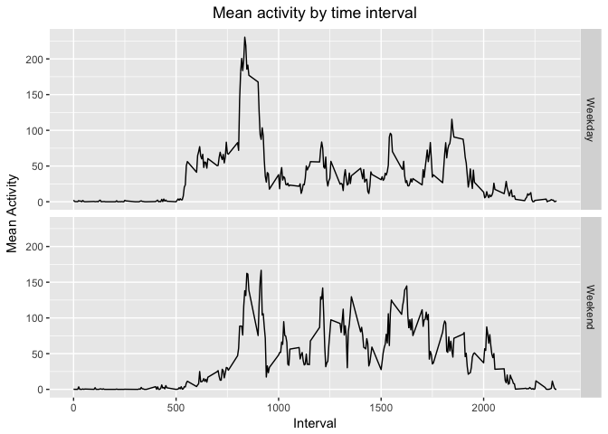

## Loading and preprocessing the data

```r
options(scipen = 1, digits = 2)
library(readr)
library(dplyr)
```

```
## 
## Attaching package: 'dplyr'
```

```
## The following objects are masked from 'package:stats':
## 
##     filter, lag
```

```
## The following objects are masked from 'package:base':
## 
##     intersect, setdiff, setequal, union
```

```r
library(ggplot2)
setwd("/Users/greg/Development/COURSEWORK/coursera-reproducible-research/week2/RepData_PeerAssessment1")
activity <- read_csv("activity.csv",na = 'NA')
```

```
## Parsed with column specification:
## cols(
##   steps = col_integer(),
##   date = col_date(format = ""),
##   interval = col_integer()
## )
```


## What is mean total number of steps taken per day?


```r
totalsteps <- sum(activity$steps, na.rm = TRUE) 
act.by.date <- activity %>%
  group_by(date) %>%
  summarize(total=sum(steps)) 
  
  ggplot(act.by.date, aes(x=date,y=total)) +
  geom_bar(stat='identity', position=position_dodge()) +
    labs(title="Total Number of Steps Taken Each Day", 
           y="Total Steps", x="Date") +
      theme(plot.title = element_text(hjust=0.5))
```

<!-- -->

```r
meansteps <- round(mean(act.by.date$total, na.rm = TRUE),0)
mediansteps <- round(median(act.by.date$total, na.rm = TRUE),0)
```

The mean number of steps taken each day is 10766 and the median number of steps taken each day is 10765. 

## What is the average daily activity pattern?

```r
act.by.interval <- activity %>%
  group_by(interval) %>%
  summarize(mean=mean(steps,na.rm=TRUE))

 ggplot(act.by.interval, aes(x=interval,y=mean)) +
  geom_line() +
    labs(title="Mean activity by time interval", 
           y="Mean Activity", x="Interval") +
      theme(plot.title = element_text(hjust=0.5))
```

<!-- -->

```r
 maxint <- act.by.interval[ act.by.interval$mean == max( act.by.interval$mean ) , 1]
```
One average the 5-minute interval with the highest number of steps is interval 835. 

## Imputing missing values


```r
act.nas <- sum(is.na(activity))
new.act <- merge(activity, act.by.interval, by='interval', all.x = TRUE )
new.act$impute <- if_else(is.na(new.act$steps),new.act$mean,as.double(new.act$steps))
act.by.date.impute <- new.act %>%
  group_by(date) %>%
  summarize(total=sum(impute)) 

  ggplot(act.by.date.impute, aes(x=date,y=total)) +
  geom_bar(stat='identity', position=position_dodge()) +
    labs(title="Total Number of Steps Taken Each Day (Including Imputation)", 
           y="Total Steps", x="Date") +
      theme(plot.title = element_text(hjust=0.5))
```

<!-- -->

```r
meansteps.impute <- round(mean(act.by.date.impute$total, na.rm = TRUE),0) 
mediansteps.impute <- round(median(act.by.date.impute$total, na.rm = TRUE),0) 
```

The total number of NAs in the dataset is 2304. The mean number of steps taken each day including imputation is 10766 and the median number of steps taken each day including imputation is 10766. There is no impact to the mean value and only a minor impact to the median value from imputation. 

## Are there differences in activity patterns between weekdays and weekends?


```r
act.by.date.impute$day <- weekdays(act.by.date.impute$date)
act.by.date.impute$weekdays <- as.factor(if_else(act.by.date.impute$day %in% c("Saturday","Sunday"),"Weekend","Weekday"))

weekdays.weekends <- merge(new.act, act.by.date.impute, by="date", all.x = TRUE)

act.by.interval2 <- weekdays.weekends %>%
  group_by(weekdays,interval) %>%
  summarize(mean=mean(impute,na.rm=TRUE))

ggplot(act.by.interval2, aes(x=interval,y=mean)) +
  geom_line() +
  facet_grid(weekdays ~ .) +
    labs(title="Mean activity by time interval", 
           y="Mean Activity", x="Interval") +
      theme(plot.title = element_text(hjust=0.5))
```

<!-- -->
